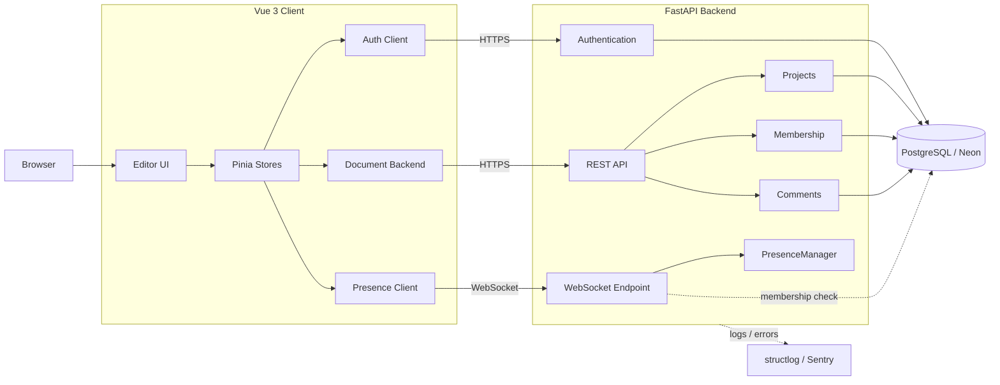
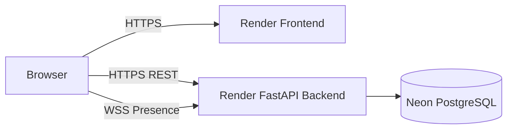

# easyFigmaV

easyFigmaV 是一個以 **Vue 3 + TypeScript + Konva** 建構編輯器前端，並以
**FastAPI + PostgreSQL** 提供帳號、雲端專案、成員授權、留言與 Presence
能力的 Figma-like 全端專案。

專案除了畫布編輯，也實作 Authentication、Cloud Persistence、Membership
Authorization、Comments、WebSocket Presence、CI 與 Observability。

> 目前多人功能定位為 **Presence（在線成員狀態）**，不是 CRDT /
> Operation-based 的多人即時共同編輯。

---

## Features

### Canvas Editor

- 以 Konva 建構支援縮放、平移與縮放感知格線的畫布。
- 支援 Rectangle、Frame、Ellipse、Line、Polygon、Star、Text。
- 支援 Pen 向量路徑、閉合路徑與 Bezier 控制點預覽。
- 支援 Pencil 自由手繪並轉換為 Vector 元素。
- 支援單選、多選、框選、拖曳、resize。
- 支援 Group / Ungroup、Duplicate、Delete 與圖層順序調整。
- Layer Panel 使用 `byId + rootIds` 管理元素樹狀結構。
- Properties Panel 支援位置、尺寸、旋轉、透明度、Fill、Stroke 與
  Typography。
- 支援畫布內文字直接編輯。
- 支援 snapshot-based Undo / Redo。
- 支援對齊輔助線、距離量測與 viewport culling。
- 提供常用編輯器快捷鍵與暫時 Hand 工具操作。

### Authentication

- Email / Password 註冊與登入。
- 密碼使用 Argon2id 雜湊。
- 使用短效 JWT Access Token，前端僅保存在記憶體。
- Refresh Token 使用 HttpOnly Cookie，Server 保存 token hash。
- 支援 Refresh Token Rotation、token family 與 replay handling。
- 前端支援 silent refresh、single-flight refresh 與 session
  bootstrap。
- Session generation guard 避免延遲中的 refresh
  在登出後重新建立登入狀態。
- 區分 refresh concurrency、session invalidation 與暫時性網路 / server
  failure。

### Cloud Projects

- 支援本機草稿與登入後的雲端專案。
- 雲端文件以 PostgreSQL `JSONB` 持久化。
- Backend 將文件視為 opaque document，畫布結構由 Frontend 負責。
- 使用 `document_version` 實作 optimistic concurrency control。
- 文件更新使用 atomic conditional update；版本過期時回傳 conflict。
- 前端自動儲存採 single-flight + latest-value coalescing，避免並行
  save request 互相覆蓋。
- 使用 generation guard 防止切換專案後舊的非同步操作污染新專案。

### Project Membership

- 專案支援 Owner / Member。
- `projects.owner_id` 是 Owner 的唯一真實來源；Owner 不重複存入
  membership table。
- Owner 可邀請既有使用者加入專案及移除成員。
- Owner 與 Member 可存取、編輯專案文件。
- 刪除專案與成員管理等 Owner-only 操作具有額外授權檢查。
- REST API 與 WebSocket 使用一致的 membership-based authorization
  boundary。
- 對 outsider 隱藏資源存在性；已知專案存在但權限不足的 Member
  依操作回傳權限錯誤。

### Comments

- 支援在畫布指定位置建立 Comment pin。
- 支援留言建立、更新、刪除與 resolved / unresolved 狀態。
- 雲端專案留言由 Backend 持久化，並沿用 Project Membership
  authorization。
- API 與資料庫層共同限制空白留言內容。
- DELETE 會檢查實際 affected
  row，處理讀取留言後至刪除前可能發生的競態。
- 本機草稿與雲端專案的留言資料邊界分離，避免雲端資料污染本機草稿。

### Online Presence

- 使用 WebSocket 顯示目前正在同一雲端專案中的成員。
- WebSocket 採 first-message authentication，Access Token 不放在 URL。
- 進行 Origin validation，補足一般 HTTP CORS middleware 不涵蓋
  WebSocket 的邊界。
- PresenceManager 以 `project → user → connections`
  管理連線，多分頁不重複計算使用者。
- Server 傳送完整 Presence snapshot，Client 使用 `seq` 過濾舊狀態。
- Client 支援斷線重連、backoff 與 authentication refresh。
- Presence 故障與 Editor 核心功能隔離，不讓即時狀態服務阻斷文件編輯。

---

## Architecture



### State Boundary

easyFigmaV 將資料分成兩種不同生命週期：

- **Durable State**：帳號、Project、Document、Membership、Comments
  儲存在 PostgreSQL。
- **Ephemeral State**：Presence 僅保存在單一 Backend instance
  的記憶體中。

因此 WebSocket Presence 不參與文件同步；文件仍透過 REST
API、`document_version` 與 optimistic locking 維持一致性。

---

## Engineering Highlights

Topic Design

---

Authentication Short-lived JWT + HttpOnly Refresh Token Rotation
Password Security Argon2id
Authorization Project membership-based authorization
Document Consistency `document_version` optimistic locking
Cloud Auto-save Single-flight + latest-value coalescing
Real-time State WebSocket snapshot-based Presence
Database PostgreSQL + SQLAlchemy 2.0 async + Alembic
Logging structlog + Request ID correlation
Error Monitoring Sentry with sensitive-data filtering
CI Frontend / Backend lint, test, migration and build checks

---

## Tech Stack

### Frontend

- Vue 3
- TypeScript
- Vite
- Pinia
- Vue Router
- PrimeVue
- UnoCSS
- Konva
- Vitest

### Backend

- Python
- FastAPI
- SQLAlchemy 2.0
- asyncpg
- Alembic
- PostgreSQL
- pytest
- Ruff

### Infrastructure & Observability

- Render
- Neon
- PgBouncer
- GitHub Actions
- structlog
- Sentry

---

## Key Technical Decisions

### Optimistic document locking

雲端文件更新不採「最後寫入者直接覆蓋」。

Client 更新文件時帶上目前的 `document_version`，Backend 以 expected
version 執行 atomic update。若其他 Client 已先更新文件，舊版本寫入會收到
conflict，而不是靜默覆蓋較新的資料。

### Cloud save serialization

Debounce 只能降低儲存頻率，不能保證 HTTP request 的完成順序。

因此 Cloud Document Backend 同時間只允許一個 save request
執行；儲存期間產生的新 snapshot 只保留最新值，前一個 request
完成後再繼續儲存最新 snapshot。

### Membership authorization

Authentication 與 Authorization 分開處理：

1.  Authentication 確認目前使用者身分。
2.  Project access 依 `projects.owner_id` 或 membership
    判斷是否可存取資源。
3.  Owner-only 操作額外進行 Owner authorization。

Owner 身分只存在於 `projects.owner_id`，避免同時維護 owner 欄位與
membership row 造成兩個 truth source。

### Snapshot-based Presence

Presence 的目標是回答「現在有哪些成員正在這個專案裡？」，而不是同步
Canvas operation。

目前採用完整 snapshot 而非 join / leave delta：

- Room 規模小，payload 成本可控。
- Client 不需要自行重建 Presence state。
- Reconnect 後可直接以最新 snapshot 取代舊狀態。
- 降低 delta 遺失或順序錯亂造成狀態不一致的風險。

PresenceManager 目前是單一 process 的 in-memory state，因此 v1 維持單一
Backend instance。未來若需要 horizontal scaling，可再將 Presence state /
transport 移至 Redis 等共享基礎設施。

---

## Observability

Backend 使用 structured logging 與 request correlation：

- 每個 HTTP request 建立 / 傳遞 Request ID。
- Application、Uvicorn、SQLAlchemy log 進入一致的 logging pipeline。
- Production 使用 JSON log，開發環境使用較易閱讀的輸出。
- Sentry 僅在設定 DSN 時啟用。
- 不設定 Sentry user context。
- 對 credential、query parameter、proxy IP 等敏感資訊進行 scrub。
- `client_ip` 可保留於安全用途的 Server log，但不送入 Sentry。

除了單元 / 整合測試，也以實際 ASGI unhandled exception 路徑驗證 Sentry
event、stack trace、Request ID 與敏感資料過濾。

---

## CI

Frontend 與 Backend 使用分離的 GitHub Actions workflow。

### Frontend

```text
npm ci
→ lint
→ type-check
→ unit tests
→ build
```

### Backend

```text
install dependencies
→ Ruff
→ Alembic upgrade
→ Alembic migration check
→ pytest
```

Backend CI 將 migration validation 與 pytest schema 分開，避免 Alembic
建立的 schema 與測試環境 schema setup 互相衝突。

---

## Testing

目前測試涵蓋的核心範圍包含：

- Authentication / Refresh Token lifecycle
- Project CRUD
- Optimistic document update
- Membership authorization
- Comments
- WebSocket authentication / Origin / Presence lifecycle
- Frontend auth / session behavior
- Editor stores and UI behavior

WebSocket 除自動化測試外，也使用真實 Uvicorn server 進行 smoke
test，補足測試 transport 與 production WebSocket stack
可能不同的覆蓋缺口。

---

## Deployment



PostgreSQL 連線層考慮 asyncpg 與 PgBouncer transaction pooling
的相容性；使用 pooler 時停用 asyncpg prepared statement cache。

---

## Current Scope

easyFigmaV v1 刻意限制協作系統範圍。

**目前包含：**

- Cloud document persistence
- Owner / Member authorization
- Server-backed comments
- Online member Presence
- Optimistic document concurrency control

**目前不包含：**

- CRDT
- Operation-based collaborative editing
- 即時 cursor / selection synchronization
- Redis-backed multi-instance Presence
- 完整 RBAC
- Invitation token / email invitation flow
- Project ownership transfer

這些限制讓 v1 先建立清楚的 Authentication、Authorization、Persistence 與
Presence 邊界，再保留未來擴充多人即時協作的空間。

---

## Technical Documentation

更完整的架構設計、技術決策、替代方案與 trade-offs 請參考：

- [Technical Documentation](./docs/README.md)
- [Backend Foundation](./docs/01-backend-foundation.md)
- [Authentication](./docs/02-authentication.md)
- [API & Deployment](./docs/03-api-and-deployment.md)
- [Auth Security Runbook](./docs/04-auth-security-runbook.md)
- [Frontend Authentication](./docs/05-frontend-auth.md)
- [Project Persistence](./docs/06-project-persistence.md)
- [Cloud Persistence](./docs/07-cloud-persistence.md)
- [CI](./docs/08-ci.md)
- [Observability](./docs/09-observability.md)
- [Membership &
  Authorization](./docs/10-membership-and-authorization.md)
- [WebSocket Presence](./docs/11-websocket-presence.md)
- [Comments](./docs/12-comments.md)
- [v1 Architecture](./docs/13-v1-architecture.md)
